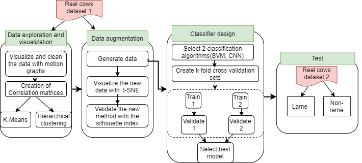
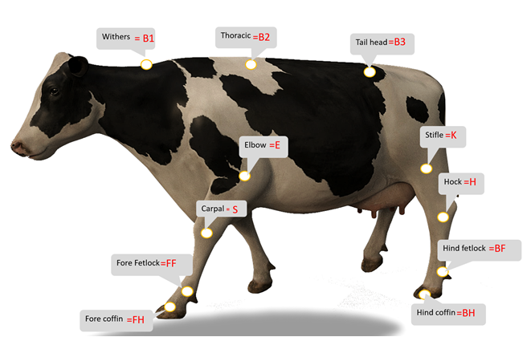
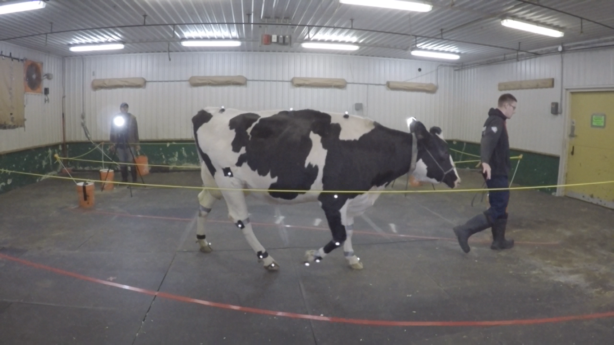
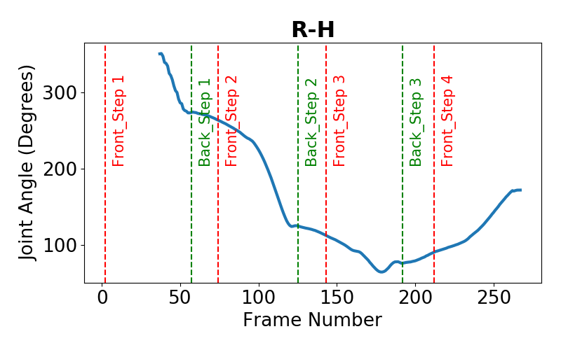
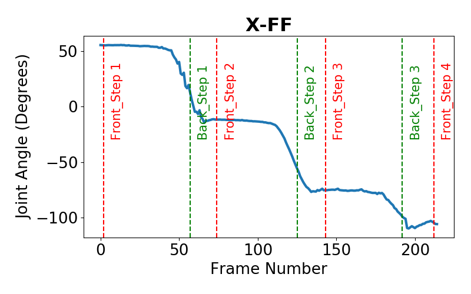
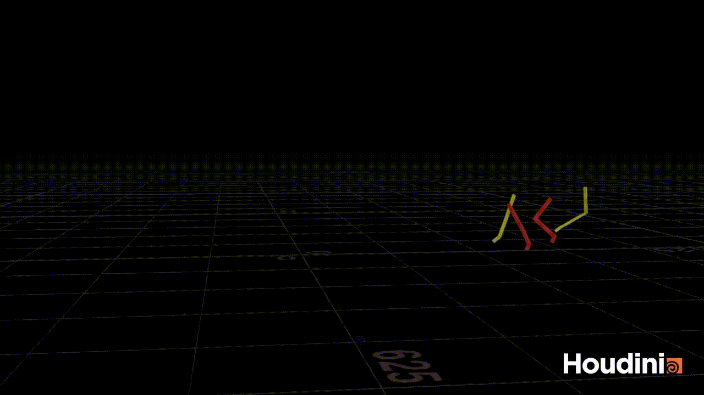

# Welfare_AI
## Machine Learning Methods for Lameness Identification in Dairy Cattle

This repository provides code for this bachelor thesis:

**Machine Learning Methods for Lameness Identification in Dairy Cattle** 
> [Yasmine Karoui](https://github.com/Yasminekaroui) 
**Abstract:** *Lameness, characterized by an anomalous gait in cows due to a dysfunction in their locomotive system, is a serious welfare issue for cows and farmers. Prompt lameness detection methods can prevent the development of acute lameness in cattle. In this study, we propose a deep learning framework to help identify lameness based on motion curves of different leg joints on the cow. The framework combines data augmentation and a convolutional neural network using an LeNet architecture. Performance assessed using cross validation showed promising prediction accuracies above 99\% and 91\% for 
validation and test sets, respectively. This also demonstrates the usefulness of data generation in cases where the data set is originally small in size and difficult to generate.*

This is the research pipeline of the thesis:

  

### Background: 
- Lameness can cause pain or physical/neurological trauma in affected dairy cows and reduce their milk productivity. It is the third leading cause of their culling after mastitis and infertility [1, 2].

- Visual gait scoring is used to rank an animal's walking ability but traditional methods are costly, manually intensive, subjective and time-consuming, making them both susceptible to human error. They also cannot be scaled up as the size of the farm increases [3].

- Automatic lameness detection systems have been developed using various types of sensors (accelerometers, radars, RGB video and 3D imaging) and machine learning models like support vector machines [4], K- Nearest Neighbor [5] and Long-Short-Term Memory cells [6] with high accuracies (all above 94%).

- However, large and accessible datasets are necessary for developing such models, but unfortunately, these are still rare to come by or produce in the dairy farming sector.

### Objective: 
In this study, we investigate whether data augmentation can be used to mitigate the lack of available gait scoring data for a dairy farm, and we develop a CNN based on a modified LeNet [7] architecture and a SVM as a baseline to test our hypothesis and classify lame and non- lame cows primarily using synthetic data.
The study is composed of 4 parts:
 1- Introduction
 
 2- Data Collection 
 
 3_ Data Exploration and Preprocessing
 
 4- Data Augmentation
 
 5- Binary Classification Non-lame vs Lame cows

These two Simulations show two examples of generated data.

### Data Collection:
A set of 15 random Holstein cows (lame and non-lame) was selected for kinematic gait analysis. Reflective markers were placed on eight points on each side of the cow’s body (Fig. 2). (screenshot_ballerina.png , cow_markers.png)

  
  

Videos of cows walking along a passageway were recorded and scored by a trained visual observer. A 3D biomechanical analysis program (Vicon Motus 10.0; CONTEMPLAS GmbH, Kempton, Germany) created a motion template (Fig. 2) for each leg joint angle and each cow using the acquired video. Automatic tracking of the reflective markers in the X, Y and Z planes, as well as the rotational matrix R, was then carried out. This process was repeated three times across a span of 14 weeks. (Fig. 3)

  
  

### Data Exploration and Clustering

### Data Augmentation
Additional synthetic data (up to 24 000 samples) was derived from the real cows (15 samples) by adding random variation with magnitudes of 1, 2, 5, 10, 15 and 20% to the original data and then smoothing with a median filter. 
A simulation of a synthetic cow  is shown in this video:

  

### Binary Classification Non-lame vs Lame cows
- A modified LeNet (Fig. 4) was created by adding 4 additional batch-normalization layers after max-pooling.

  

- The model was trained using the generated and original samples. Each time sequence contained 192 values for each variable, corresponding to a total of 3 front and back steps. 

- The data set was balanced with 12000 (50%) lame and non- lame cow examples. 

- The model was tested using 13 examples of cows (6 lame, 7 non-lame) that were not generated nor included in the training process at the very end of the experiment.

- A SVM classifier was also trained and evaluated on the same data 

### Results 
Multiple CNN models were built based on the configuration mentioned in the previous section. During training, the models were evaluated following a 5-fold cross-validation framework using a Monte Carlo optimization approach (tab. 1).

<table>
  <tr>
    <th>Variation (%)</th>
    <th>Accuracy (%)</th>
    <th>Precision (%)</th>
    <th>Recall (%)</th>
    <th>F1-score (%)</th>
  </tr>
  <tr>
    <td>1</td>
    <td>76.84</td>
    <td>78.60</td>
    <td>777.60</td>
    <td>76.40</td>
  </tr>
  <tr>
    <td>2</td>
    <td>83.80</td>
    <td>83.80</td>
    <td>83.60</td>
    <td>83.20</td>
  </tr>
  <tr>
    <td>5</td>
    <td>90.76</td>
    <td>92.20</td>
    <td>91.40</td>
    <td>90.60</td>
    
  </tr>
  <tr>
    <td>10</td>
    <td>81.54</td>
    <td>84.60</td>
    <td>82.40</td>
    <td>81.40</td>
  </tr>
  
  </tr>
  <tr>
    <td>15</td>
    <td>79.99</td>
    <td>84.60</td>
    <td>80.04</td>
    <td>80.02</td>
  </tr>
  
</table>

